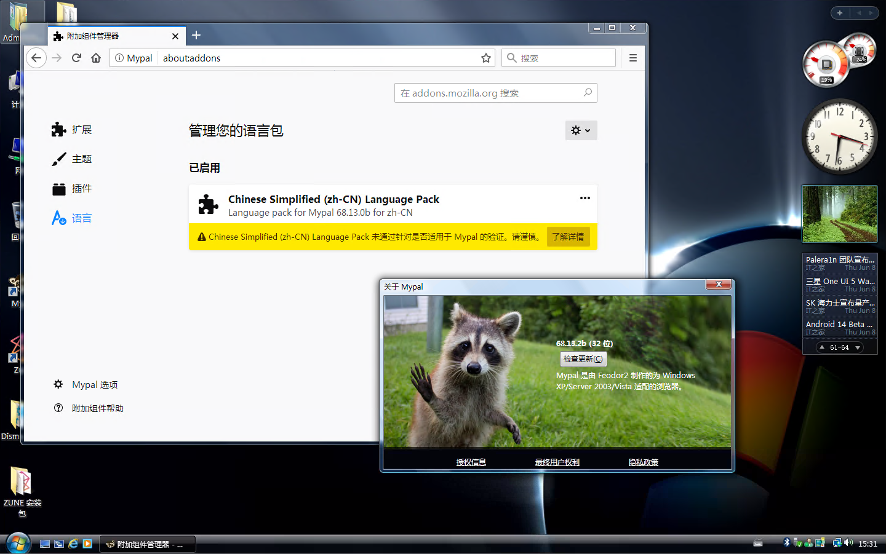

# Mypal68 简体中文语言包

## Mypal68 Simplified Chinese language pack

Mypal自68.13.0b版本起修改了文本，导致之前的语言包安装后会无法使用，因此制作了这个语言包。

## 安装和使用该语言包的要求
* 电脑配置不能太落后(干啥都卡的电脑建议还是抬走或者重装系统吧)
* [Mypal](https://github.com/Feodor2/Mypal68/releases/latest) 68.13.0b和之后的版本

## 下载语言包
直接点击[release](https://github.com/hawnpxtl/Mypal68-zh_CN-xpi/releases/latest)下载即可