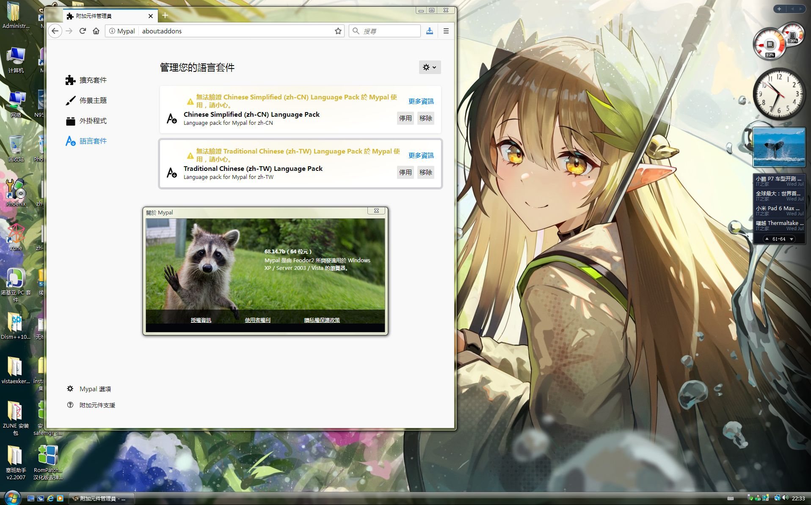

# Mypal68 繁體中文語言包

## Mypal68 Traditional Chinese Language Pack

[](https://www.pixiv.net/artworks/108396628)

Mypal自68.13.0b版本起修改了一些文本位置，導致之前的語言包安裝後會無法使用（[具體看此issue](https://github.com/Feodor2/Mypal68/issues/203)），因此製作了這個語言包。

## 安裝和使用該語言包的要求
* 一台配置不算太老，且裝有Windows XP以上系統的電腦
* 
* [Mypal](https://github.com/Feodor2/Mypal68/releases/latest) 68.13.0b和之後的版本
* 知道如何安裝xpi插件

## 下載語言包
直接點擊[release](https://github.com/shawnpxtl/Mypal68-chinese-xpi/releases/latest)下載zh-TW.xpi且安裝後切換語言即可。

## 已經無法開啟瀏覽器，但是想在保留資料的前提下更新語言包
請開啟以下目錄：
   ```bash
   Windows XP：%APPDATA%\Mypal68\Profiles\"随机乱码".default-default\extensions
   Windows Vista及以上：%APPDATA%\Roaming\Mypal68\Profiles\"随机乱码".default-default\extensions
   ```
然後刪除langpack-"zh-TW"@mypal.org.xpi，刪除後重新開啟瀏覽器，這時候你會發現介面變英文了，不用慌，安裝新版本語言包即可。  
PS：其它語言同樣可以用此方法修復（總之就是刪除langpack-"**"@mypal.org.xpi這個檔案即可）